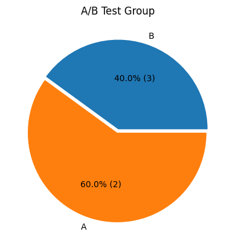
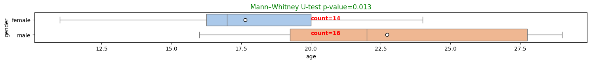
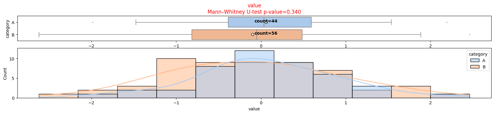

# pltstat: A Python Library for Statistical Data Visualization

[](https://pypi.org/project/pltstat/)

`pltstat` is a Python library designed to facilitate the visualization of statistical data analysis. This library includes a variety of tools and methods to streamline data exploration, statistical computation, and graphical representation.

---

## Installation

### Requirements

Before installing, make sure that you are using **Python 3.12**.  
You can check your Python version by running:

   ```bash
   python --version
   ```

You can download it from the [official Python website](https://www.python.org/downloads/release/python-3120/).

  
### Installation

To install the `pltstat` library, simply run the following command:

```bash
pip install pltstat
```

This will install the library along with all the required dependencies as specified in the [`requirements.txt`](requirements.txt) file.

After installation the package, you can start using `pltstat` by importing the necessary modules in your Python scripts.

---

## File Descriptions

### Python Modules

- **[`__init__.py`](pltstat/__init__.py)**
  - Marks the directory as a Python package. This file allows you to import modules from the `pltstat` package.

- **[`singlefeat.py`](pltstat/singlefeat.py)**
  - Dedicated to the analysis and visualization of single-variable features, including plotting functions such as pie charts, count plots, and histograms.

- **[`twofeats.py`](pltstat/twofeats.py)**
  - Provides tools for analyzing interactions between two features. Includes functions for creating crosstabs, computing correlations, and visualizing results using violin plots, boxplots, and distribution box plots. These functions also display p-values and other statistical metrics to summarize relationships between the two features.

- **[`multfeats.py`](pltstat/multfeats.py)**
  - Provides tools for analyzing relationships between multiple features.  
  Includes visualization functions for analyzing missing data, comparing distributions, and visualizing dimensionality reductions. Additionally, it provides methods for creating heatmaps that display correlations and p-values, including Spearman's correlation, Mann-Whitney p-values, and Phik correlations.

- **[`circle.py`](pltstat/circle.py)**
  - Contains functions and methods related to circular statistical visualizations, such as radar charts or circular histograms.

- **[`cm.py`](pltstat/cm.py)**
  - Contains custom colormap utilities for visualizations, such as rendering correlation matrices or creating two-colored maps for p-values with a threshold (e.g., alpha).

- **[`stat_methods.py`](pltstat/corr_methods.py)**
  - Includes methods for calculating correlation matrices and related statistical relationships.

- **[`in_out.py`](pltstat/in_out.py)**
  - Provides utilities for reading, writing, and preprocessing input and output data files.

### Other Files

- **[`.gitignore`](.gitignore)**
  - Specifies intentionally untracked files to ignore in the repository, such as virtual environments and temporary files.

- **`README.md`**
  - This file provides an overview of the project, including file descriptions and usage instructions.

- **[`requirements.txt`](requirements.txt)**
  - Lists the Python dependencies required to run the library. Install them using:
    ```bash
    pip install -r requirements.txt
    ```

---

## Getting Started

1. Clone the repository:
   ```bash
   git clone https://github.com/trojanskehesten/pltstat.git
   ```

2. Navigate to the project directory:
   ```bash
   cd pltstat
   ```

3. **Python Version**: This library is compatible with [Python 3.12](https://www.python.org/downloads/release/python-3120/). Ensure you have this version installed before running the project.

4. **R Installation**: Ensure that the [R language is installed](https://cloud.r-project.org/) on your system, as the `rpy2` library (used in this project) requires it.

5. Install dependencies:
   ```bash
   pip install -r requirements.txt
   ```

6. Explore the modules and utilize the library in your projects.

---

## Usage
Each module in `pltstat` is designed to be modular and reusable. Import the required module and use its functions to visualize your statistical data.  

### Example 1: Pie Chart  
```python
import pandas as pd
from pltstat import singlefeat as sf

data = {
    "Age": [25, 30, 22, 27, 35],
    "A/B Test Group": ["A", "B", "A", "B", "A"],
}
df = pd.DataFrame(data)

# Plot a pie chart
sf.pie(df["A/B Test Group"])
```
**Result 1**  


### Example 2: Boxplot  
```python
import pandas as pd
from pltstat import twofeats as tf

# Data creation:
data = {
    "gender": ["male", "female", "female", "male", "male", "female", "female", "male", "male", 
               "female", "male", "female", "male", "male", "female", "male", "female", "male", 
               "female", "male", "female", "male", "female", "male", "female", "male", "female", 
               "female", "male", "male", "male", "male"],
    "age": [22, 20, 17, 16, 19, 17, 11, 29, 24, 12, 22, 20, 19, 16, 11, 29, 24, 20, 16, 22, 
            17, 29, 24, 16, 17, 29, 22, 19, 22, 22, 24, 29]
}

df = pd.DataFrame(data)

# Boxplot creation:
tf.boxplot(df, "gender", "age")
```
**Result 2**  


### Example 3: Boxplot and Distribution Plot
```python
import numpy as np
import pandas as pd
from pltstat import twofeats as tf

# Example DataFrame
np.random.seed(42)
df = pd.DataFrame({
    'category': np.random.choice(['A', 'B'], size=100),
    'value': np.random.randn(100),
})

# Create a boxplot and a distribution plot
tf.dis_box_plot(df, cat_feat='category', num_feat='value')
```
**Result 3**  


---

## Contributing
Contributions are welcome! If you'd like to improve the library or fix issues, please:
1. Fork the repository.
2. Create a new branch.
3. Make your changes and commit them.
4. Submit a pull request.

---

## License
This project is licensed under the BSD 3-Clause License. See the [LICENSE](LICENSE) file for details.
